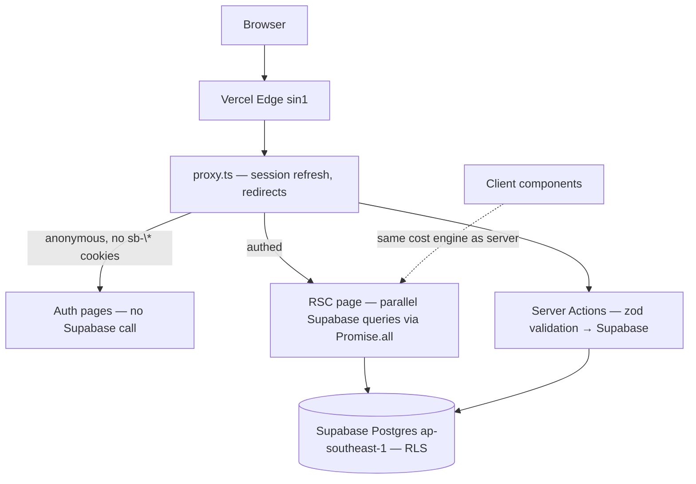
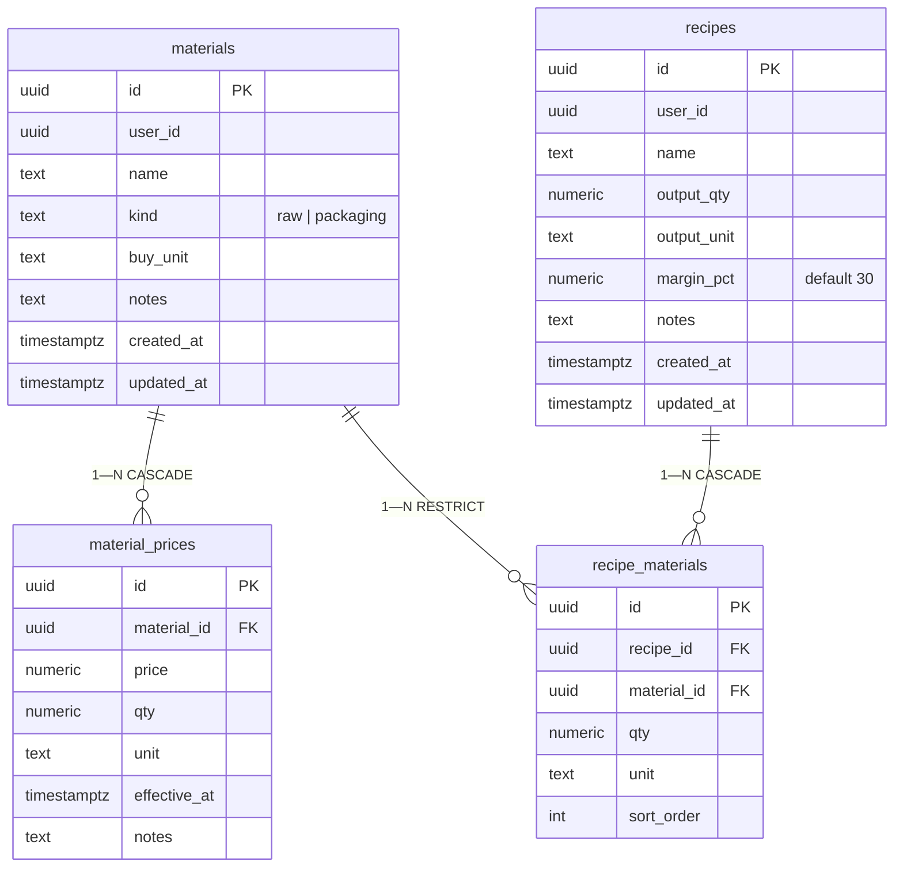

# Architecture

Catatan HPP / Lunar HPP Manager — an HPP (harga pokok produksi, cost of goods) calculator for Indonesian home-based food sellers. Live at https://lunar-hpp-manager.vercel.app.

## System overview



The render path is server-first. Pages are React Server Components; every read is a Supabase query executed in parallel with `Promise.all`. Mutations run through Server Actions validated with zod before touching the database. Row Level Security sits underneath as an enforcement layer, not the only one.

Client JavaScript is deliberately small and targeted: the live HPP preview in the recipe form (running the same cost engine as the server, so the preview matches the saved result exactly), the theme toggle, and the password visibility toggles on the auth pages.

## Data model



Four tables, one ownership chain. `materials` and `recipes` carry a `user_id` column; `material_prices` and `recipe_materials` inherit ownership from their parent rows.

**RLS ownership policy pattern.** RLS is enabled on all four tables. Policies on `materials` and `recipes` check `user_id = auth.uid()` directly. Policies on `material_prices` and `recipe_materials` — which have no `user_id` column of their own — check ownership via an `IN` subquery on the parent table's ownership instead. Every access path is therefore scoped to the authenticated user at the database layer, regardless of which application code issued the query.

**Why RESTRICT on `recipe_materials.material_id`.** A material referenced by any recipe cannot be deleted: the database refuses, and the UI surfaces a clear error. The alternative — `CASCADE` — would silently mutate every recipe that uses the material, corrupting stored cost data without warning. `RESTRICT` turns an accidental delete into a visible, recoverable refusal instead of silent data loss. Prices, by contrast, cascade: price history is meaningless without its material.

## Cost engine

Location: `src/lib/costing/` — pure TypeScript, zero framework imports.

**Unit conversion** (`unit.ts`). Three dimensions: MASS (`kg`, `gram`, `g`), VOLUME (`liter`, `L`, `ml`), COUNT (`pcs`). A `conversionFactor(buyUnit → targetUnit)` converts any quantity between units of the same dimension. Prices recorded in one unit compose cleanly with recipe quantities in another — 1 kg of flour bought at Rp 12.000 prices a 250 g recipe line correctly.

**Price resolution** (`prices.ts`). A material can carry multiple prices over time — bulk buys, vendor changes. The engine builds a `latestPrices` map keyed by `effective_at`, so each recipe line resolves against the most recent applicable price. The core formula:

```
pricePerUnit = price / (qty × conversionFactor(buyUnit → targetUnit))
```

**Recipe cost** (`recipe.ts`). `calculateRecipeCost`:

- Per-item cost: `unitCost × qty` for each recipe line.
- Raw vs packaging split: items whose material `kind = raw` and `kind = packaging` are summed separately, so the seller sees ingredient cost distinct from wrapper cost.
- `totalCost` = sum of all resolvable lines.
- `perUnit = totalCost / output_qty` — the HPP of one unit of output.
- `suggestedPrice = perUnit × (1 + margin_pct / 100)` — the price to charge.
- Unpriced materials land in `unresolvedUnits` instead of the totals: they are excluded from the sum, flagged in the UI, and never silently treated as free. A missing price is a data problem to surface, not a zero.

The exact same module runs server-side (in server components rendering saved recipes) and client-side (live preview as the recipe form is edited). This is deliberate: one implementation means the preview can never drift from the saved result. The module is framework-free, so it is portable and directly testable — 23 Vitest unit tests cover the conversions, price resolution, splits, margins, and the unresolved-price path.

## Authentication & routing

`proxy.ts` is the Next 16 proxy — the file formerly known as `middleware.ts`, renamed in Next 16 — and runs at the edge on every request. It calls `updateSession` (the Supabase SSR pattern) to refresh the session cookie and load the user, then applies redirect rules:

- Anonymous requests to protected routes → redirect to `/login`, preserving the intended destination in a `?next=` param so the user lands where they were headed after signing in.
- Authenticated requests to auth pages (`/login`) → redirect to `/`.

**Early-exit optimization.** Session refresh normally requires a Supabase round trip — unnecessary for the common case of a first-time anonymous visitor, who carries no session cookies at all. The proxy checks for `sb-*` cookies first and exits early without calling Supabase when none are present. Anonymous requests to `/login` therefore skip the network entirely: TTFB of 435 ms including proxy execution. Authenticated users, who do carry cookies, still get a proper session refresh.

RLS is the second layer: even if a routing mistake exposed a page to an unauthenticated request, the queries underneath would return nothing.

## Performance engineering

### The latency forensics story

The production dashboard felt slow after deploy — noticeably slower than local development. Local measurement said the code was fast, so the problem was infrastructure, and it had to be measured where it ran.

**Measurement first.** `curl` timing against production, repeated for a median:

| Route | TTFB (median, before) |
|---|---|
| `/` (dashboard) | 2176 ms |
| `/recipes/[id]` | 1614 ms |
| `/materials` | 1499 ms |
| (other app routes) | 984 ms |
| (other app routes) | 777 ms |
| Anon floor (`/login`, no session work) | 424 ms |

Every authenticated route was paying over a second of latency that local did not.

**Diagnosis.** The response header `x-vercel-id: sin1::iad1` was the clue: edge in Singapore (`sin1`) but the serverless function in US East (`iad1`) — while the Supabase database sits in `ap-southeast-1` (Singapore). Every database query paid a round trip from US East to Singapore and back, ~230–250 ms each way-RTT. The dashboard issued 4 sequential queries, so the geography tax compounded: ~920 ms of pure network round-trip time before any real work.

**Fixes.**

1. **Parallelize queries** (`Promise.all`). All multi-query pages were refactored from sequential `await` chains to parallel fetches — 4 independent queries collapsed to 1 flight (commit `276caa4`). Necessary but insufficient: one 250 ms round trip still remained, plus function cold-start and region hops.
2. **Colocate the function with the database.** Vercel function region moved from `iad1` to `sin1`, putting compute next to the Postgres instance in `ap-southeast-1`. The ~230–250 ms trans-Pacific RTT dropped to single-digit intra-region latency.

**Result.** Production feel now matches local; routes are sub-second.

### Lighthouse journey: 95/97 → 98–100

- **Auth pages: CSR bailout.** The auth pages originally used `useSearchParams` in a client component, which forces Next to fall back to client-side rendering — the LCP waited for hydration before anything appeared. Rewritten as pure SSR with server actions: the page renders on the server, errors pass through a `?error=` param, and the only client island is a 1 KB password visibility toggle.
- **Variable font.** Nunito loaded as a single variable font file — 38.5 KB, `display: optional` — instead of multiple weight files.
- **Toaster relocation.** `sonner`'s `<Toaster>` moved out of the root layout, so it loads only where toasts are actually rendered.
- **`label.tsx` as a server component.** One shadcn primitive converted to a server component, trimming client JS for nothing.

**An honest caveat.** Local Lighthouse scores plateau at 98 due to the simulator's HTTP/1.1 limitation — the localhost floor is 98 even when nothing else can improve. Real HTTP/2 production measurement reads 100. The 98 is a tool artifact, not a page problem.

## Incidents & lessons learned

### 1. Stray pnpm lockfile broke Vercel builds

An early accidental `pnpm dev` left a `pnpm-lock.yaml` in the repo. Vercel's build image auto-detected pnpm from the lockfile and ran pnpm against a project that uses npm — builds failed on an install that never should have run. Fixed by removing the stray lockfile, declaring `packageManager: npm@12` in `package.json`, and pinning the Vercel install command to `npm ci` via PATCH. Lesson: lockfiles are infrastructure config, not junk files — what's in the repo determines how the build machine behaves.

### 2. Commit author email blocked deploys

The local commit author email was `rev@Revangga-MacBook-Pro.local`. Vercel rejected deployments because the author email did not match the connected GitHub account. Fixed via `git config`, then a `rebase --root --reset-author` and force-push to rewrite history with the correct email. Lesson: `.local` emails from machine-generated git defaults will break any deploy system that verifies commit authorship against GitHub — set the email before the first commit.

### 3. Auth pages: Next 16 CSR bailout

`useSearchParams` in a client component forces client-side rendering in Next; in Next 16 this manifested as auth pages whose LCP waited for full hydration — nothing visible until JS loaded and ran. Rewritten as pure SSR with server actions (error state via `?error=` param), leaving only a 1 KB password-toggle client island. Lesson: reach for the smallest client surface that answers the need; `useSearchParams` is not free in RSC.

### 4. next-themes hydration warning

`next-themes` mutates the `<html>` element directly (adding a class before React hydrates), which React flags as a hydration mismatch. Fixed with `suppressHydrationWarning` on `<html>` — the warning is a known, intentional library behavior, not an app bug. Lesson: read the library's docs before "fixing" a warning the library itself documents as expected.

### 5. Stray Vercel CLI project with dead alias

An early experiment had created a project via the Vercel CLI with its own deployment alias. After moving to the real project, that stray alias 404'd and shadowed the production URL. Fixed by deleting the stray CLI project entirely and re-deploying manually to a clean state, so only one project owns the domain. Lesson: CLI-created projects linger with their own aliases and DNS weight — when migrating between deploy setups, delete the old project, don't just abandon it.

## Deployment

- **Platform:** Vercel. Edge in `sin1` + serverless functions in `sin1`, colocated with the database. Node 24.x, `npm ci`, build time ~36 s.
- **Database:** Supabase Postgres in `ap-southeast-1` (Singapore), with RLS on all tables and email/password auth.
- **Deploy flow:** `git push` → auto deploy. No manual steps.
- **Environment variables:** `NEXT_PUBLIC_SUPABASE_URL`, `NEXT_PUBLIC_SUPABASE_ANON_KEY` (client-exposed, used by both client and server Supabase clients), and `NEXT_PUBLIC_APP_URL`. No service role key is used anywhere — the app runs entirely as the authenticated user, behind RLS.
- **Live:** https://lunar-hpp-manager.vercel.app

Region layout is the deployment story: edge `sin1` → function `sin1` → Supabase `ap-southeast-1`, all in one corner of the world, because the users are in Indonesia and the latency forensics proved geography matters.
